# Hi, I'm Banu Varsha Murakonda

### CSE Undergraduate @ PES University • AI/ML • GenAI • Software Engineering • Data • 5G Security

I build practical systems at the intersection of **machine learning, intelligent software, data, and network security**.

I like taking a problem from:

**idea → architecture → implementation → experimentation → usable system**

---

## What I Work With

<table>
<tr>
<td width="50%">

### AI / ML / GenAI

- Machine Learning
- NLP
- Generative AI
- RAG
- LLM applications
- PyTorch / scikit-learn

</td>
<td width="50%">

### Software Engineering

- Python
- Java
- C / C++
- JavaScript / TypeScript
- React
- Node.js / FastAPI

</td>
</tr>

<tr>
<td>

### Data & Systems

- Pandas / NumPy
- MongoDB / Firebase
- SQL
- Distributed systems
- Real-time analytics

</td>
<td>

### 5G / Security

- Open5GS
- UERANSIM
- 5G Core
- Network security
- Privacy-aware systems

</td>
</tr>
</table>

---

## Featured Projects

### 🧭 Code Archaeologist

**Git history reconstruction + grounded RAG for developers**

Reconstructs function evolution across commits, tracks renames/refactors, grounds changes in GitHub issues/PRs and produces structured explanations with verification checks.

→ [View repository](https://github.com/BanuVarsha10/code-archae)

### 🛡️ CAPSS

**Context-aware privacy and security for 5G**

An adaptive privacy decision system for 5G UE registration using Open5GS + UERANSIM, registration-context analysis, privacy scoring, RAG and a full-stack live dashboard.

→ [View repository](https://github.com/BanuVarsha10/CAPSS)

### 🧬 Drug–Drug Interaction Prediction

**Graph learning for drug interaction prediction**

Experiments with graph representations, GNNs and feature-engineered models for predicting previously undocumented drug interactions, including leak-free and cold-start evaluation.

→ [View repository](https://github.com/Vihas111/capstone)

---

## Experience & Research

- **Research Intern — 5G Wireless Systems Laboratory, PESU ISFCR SOC**
- **Teaching Assistant — PES University**
- **Club Head — APPEX PESU**
- **PR & Campaigning Head — Samarpana India**
- Research across **AI/ML, GenAI, developer tooling, healthcare ML and 5G privacy/security**

---

## Current Interests

`AI Agents` · `RAG` · `NLP` · `Graph ML` · `Developer Tools` · `Data Engineering` · `Distributed Systems` · `5G Security`

---

## GitHub

  
  

---

## Let's Connect

---

  <i>Build useful things. Understand the systems underneath. Keep learning.</i>

